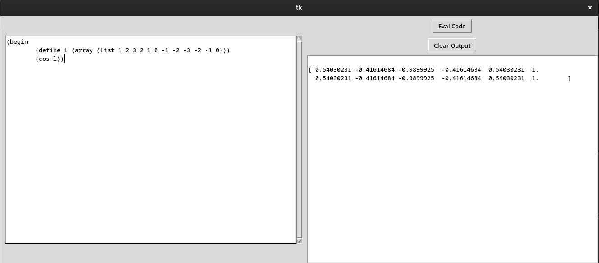

# Quanty LISP
##### A simple LISP written in python aimed at quantitative researchers

This is a first implementation of a simple LISP including
an editor to allow for quick and interactive research of quantitative trading strategies.

(Shamelessly stolen) based on Peter Norvigs LISPY: http://norvig.com/lispy.html

## Features
* is a lisp
* includes all of numpy and python maths

## Drawbacks
* its alpha but not the kind you are looking for

## TODO
### LISP
* implement basic LISP functionality like (repl, set!)
* add support for CSV, matplotlib, pandas
* add support to directly call python functions (maybe...)
### Editor
* add auto formatting
* syntax checking
* autocomplete with dropdown

